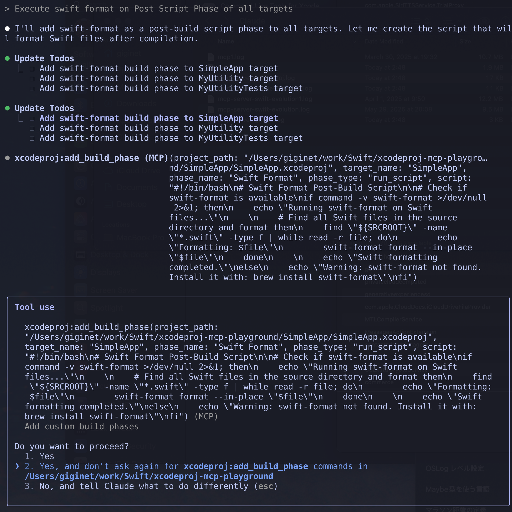

# xcodeproj-mcp-server


[](https://developer.apple.com/xcode/)
[](https://swift.org/package-manager/) 

[
](https://github.com/giginet/xcodeproj-mcp-server/blob/main/LICENSE.md)

> [!WARNING]
> This product is in the development phase. It will be released soon.

A Model Context Protocol (MCP) server for manipulating Xcode project files (.xcodeproj) using Swift.



## Overview

xcodeproj-mcp-server is an MCP server that provides tools for programmatically manipulating Xcode project files. It leverages the [tuist/xcodeproj](https://github.com/tuist/xcodeproj) library for reliable project file manipulation and implements the Model Context Protocol using the [swift-sdk](https://github.com/modelcontextprotocol/swift-sdk).

This server enables AI assistants and other MCP clients to:
- Create new Xcode projects
- Manage targets, files, and build configurations
- Modify build settings
- Add dependencies and frameworks
- Automate common Xcode project tasks

## How to set up for Claude Desktop and Claude Code

### Prerequisites

- Docker
- macOS (for running Xcode projects)

### Installation using Docker

Pull the pre-built Docker image from GitHub Container Registry:

```bash
docker pull ghcr.io/giginet/xcodeproj-mcp-server
```

### Configuration for Claude Desktop

Add the following to your Claude Desktop configuration file:

**macOS**: `~/Library/Application Support/Claude/claude_desktop_config.json`

```json
{
  "mcpServers": {
    "xcodeproj": {
      "command": "docker",
      "args": [
        "run",
        "--rm",
        "-i",
        "-v", "/path/to/allowed/workspace:/workspace",
        "ghcr.io/giginet/xcodeproj-mcp-server",
        "/workspace"
      ]
    }
  }
}
```

Replace `/path/to/allowed/workspace` with the directory you want to restrict file operations to. This directory will be mounted as `/workspace` inside the container.

### Configuration for Claude Code

```bash
# Add MCP server using Docker
$ claude mcp add --name xcodeproj --command "docker" --args "run" "--rm" "-i" "-v" "/path/to/allowed/workspace:/workspace" "ghcr.io/giginet/xcodeproj-mcp-server" "/workspace"
```

Replace `/path/to/allowed/workspace` with the directory you want to restrict file operations to.

### Path Security

The MCP server now supports restricting file operations to a specific base directory. When you provide a base path as a command-line argument:

- All `project_path` and file path parameters will be resolved relative to this base path
- Absolute paths are validated to ensure they're within the base directory
- Any attempt to access files outside the base directory will result in an error

This is especially useful when running the server in Docker containers or other sandboxed environments.

## Available Tools

### Project Management

- **`create_xcodeproj`** - Create a new Xcode project
  - Parameters: `project_name`, `path`, `organization_name`, `bundle_identifier`

- **`list_targets`** - List all targets in a project
  - Parameters: `project_path`

- **`list_build_configurations`** - List all build configurations
  - Parameters: `project_path`

- **`list_files`** - List all files in the project
  - Parameters: `project_path`

### File Operations

- **`add_file`** - Add a file to the project
  - Parameters: `project_path`, `file_path`, `target_name`, `group_path`

- **`remove_file`** - Remove a file from the project
  - Parameters: `project_path`, `file_path`

- **`move_file`** - Move or rename a file within the project
  - Parameters: `project_path`, `source_path`, `destination_path`

- **`create_group`** - Create a new group in the project navigator
  - Parameters: `project_path`, `group_name`, `parent_group_path`

### Target Management

- **`add_target`** - Create a new target
  - Parameters: `project_path`, `target_name`, `type`, `platform`, `bundle_identifier`

- **`remove_target`** - Remove an existing target
  - Parameters: `project_path`, `target_name`

- **`duplicate_target`** - Duplicate an existing target
  - Parameters: `project_path`, `source_target_name`, `new_target_name`

- **`add_dependency`** - Add dependency between targets
  - Parameters: `project_path`, `target_name`, `dependency_name`

### Build Configuration

- **`get_build_settings`** - Get build settings for a target
  - Parameters: `project_path`, `target_name`, `configuration_name`

- **`set_build_setting`** - Modify build settings
  - Parameters: `project_path`, `target_name`, `setting_name`, `value`, `configuration_name`

- **`add_framework`** - Add framework dependencies
  - Parameters: `project_path`, `target_name`, `framework_name`, `embed`

- **`add_build_phase`** - Add custom build phases
  - Parameters: `project_path`, `target_name`, `phase_type`, `name`, `script`

### Utility

- **`open_xcodeproj`** - Open an Xcode project in Xcode
  - Parameters: `project_path`, `wait` (optional)

## License

This project is licensed under the MIT License.

